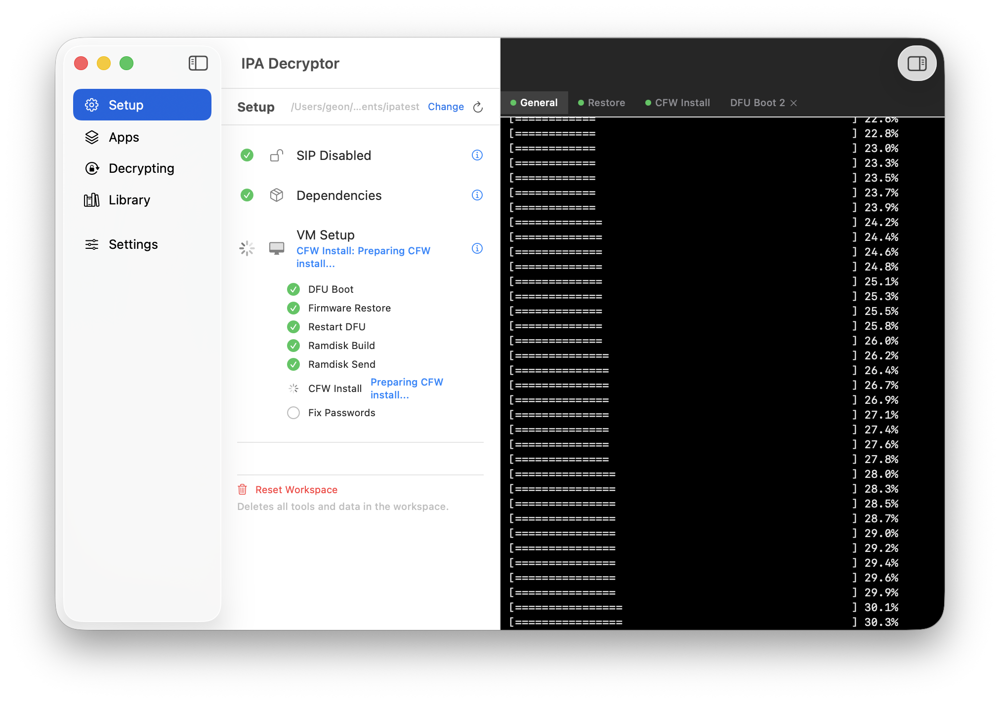
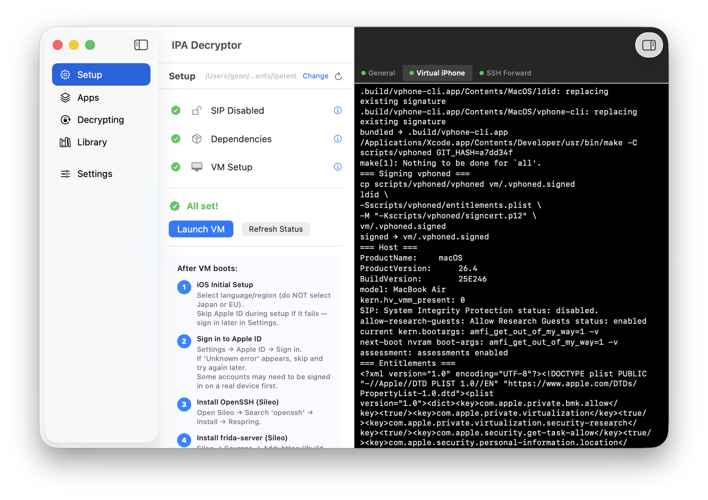

# IPA Decryptor

**Proof of Concept** — Extract decrypted IPA files from iOS apps without a physical iOS device.

Uses [vphone-cli](https://github.com/Lakr233/vphone-cli) (virtual jailbroken iPhone on Apple Silicon) and [frida-ios-dump](https://github.com/AloneMonkey/frida-ios-dump) (runtime binary decryption) to build a fully automated IPA extraction pipeline on macOS.

## How It Works

```
macOS App (IPA Decryptor)
  |
  |-- 1. Setup: Installs vphone-cli, builds virtual iPhone VM
  |-- 2. Boot:  Launches virtual jailbroken iPhone (iOS 26)
  |-- 3. User:  Sets up iOS, installs apps from App Store via vphone GUI
  |-- 4. Scan:  Lists installed apps via SSH
  |-- 5. Dump:  Runs frida-ios-dump to extract decrypted binary from memory
  |-- 6. Save:  Outputs decrypted .ipa to Library
```

### Why This Works

- iOS apps from the App Store are encrypted with Apple's FairPlay DRM
- FairPlay decryption only happens at runtime, in the device's memory
- vphone-cli runs a real iOS VM with a jailbreak (Sileo, TrollStore, frida-server)
- frida-ios-dump attaches to the running app process and dumps the decrypted binary
- No physical iPhone or jailbroken device required — runs entirely on Mac

## Requirements

- **Apple Silicon Mac** (M1 or later)
- **macOS 15+** (Sequoia)
- **SIP disabled** (System Integrity Protection)
- **Xcode** installed (for iOS SDK)
- **~80GB free disk space** (VM image + firmware)

## Screenshots

### VM Setup — Automated Installation

*Automated dependency installation and VM firmware setup with real-time console output*

### Ready to Launch

*Setup complete with step-by-step guide for iOS configuration*

## Features

### Setup Tab
- One-click dependency installation (Homebrew, vphone-cli, frida, etc.)
- Automated VM creation, firmware download/patch, restore, and CFW installation
- Step-by-step progress with real-time console output
- Manual setup guides (i) for each step
- Resume from where you left off if interrupted

### Apps Tab
- Lists all user-installed apps on the virtual iPhone via SSH
- One-click "Decrypt" button per app

### Decrypting Tab
- Real-time decryption progress (launching app, frida dump, extracting)

### Library Tab
- Collection of successfully decrypted IPA files
- Open in Finder

### Console Panel
- Real-time terminal output from all background processes
- Tabbed view for multiple concurrent processes
- Auto-cleanup of completed tabs

## Architecture

```
Sources/IPAAppStore/
  App/              Entry point + AppDelegate (process cleanup on exit)
  Models/           Data models (InstalledApp, DecryptionState, SetupItem, LogStore)
  Services/
    VMService       VM lifecycle, SSH, shell execution, setup automation
    DecryptionService  frida-ios-dump orchestration
  ViewModels/       MainViewModel (single source of truth)
  Views/
    Setup/          Setup checklist with Fix buttons
    Apps/           VM app list + Decrypt buttons
    Decryption/     Active decryption jobs
    Library/        Completed decrypted IPAs
    Common/         Layout, sidebar, console panel
    Settings/       SSH config, vphone version
```

**Zero external Swift dependencies.** Only system frameworks (SwiftUI, AppKit, Foundation).

## Technical Details

### vphone-cli Integration
- Stable version pinned to commit `a7dd34f` (tested with iOS 26.1 firmware)
- Automated: git clone, build, VM creation, firmware prepare/patch
- Semi-automated: restore, ramdisk, CFW install (sudo steps shown as terminal commands)
- First boot kernel panic detection and auto-retry

### frida-ios-dump Integration
- Runs on Mac, connects to VM's frida-server via SSH port forwarding
- Uses pymobiledevice3 for USB multiplexing
- Outputs decrypted IPA to user-configured workspace directory

### Known Limitations
- `pymobiledevice3` restore crashes with Python 3.12 (use system Python 3.9)
- Apple ID sign-in may fail in VM (serial number mismatch with Apple's activation servers)
- First boot after CFW install causes kernel panic (expected, auto-handled)
- VM requires SIP disabled and AMFI boot-arg set

## Build

```bash
swift build
./scripts/bundle.sh  # Creates IPADecryptor.app
```

## License

This project is for educational and security research purposes only. Do not use for piracy.

## Acknowledgements

- [Lakr233/vphone-cli](https://github.com/Lakr233/vphone-cli) — Virtual iPhone on Apple Silicon
- [AloneMonkey/frida-ios-dump](https://github.com/AloneMonkey/frida-ios-dump) — iOS app decryption via Frida
- [majd/ipatool](https://github.com/majd/ipatool) — Research reference for App Store API
